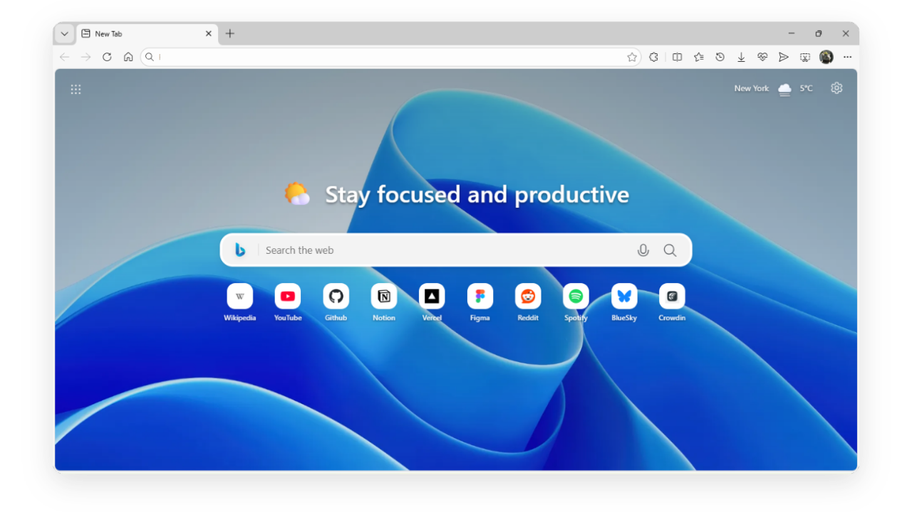

# Fluent Tab Pro



<p align="center">
  <strong>A modern new tab inspired by Microsoft's Fluent Design.</strong>
</p>

<p align="center">
  <a href="https://github.com/rookiewu417/fluent-tab-pro/releases">Installation</a> •
  <a href="CONTRIBUTING.md">Contributing</a> •
  <a href="TRANSLATING.md">Help translate</a>
</p>


## Why choose Fluent Tab Pro?

- Minimal, lightweight layout focused on productivity.
- Built-in launcher for Microsoft 365, Google Workspace, and Proton.
- Fast search with voice input and optional suggestions.
- Unlimited shortcuts with automatic high-quality favicons.
- Adaptive theme: Light, Dark, or System.
- Privacy-first: no tracking or telemetry.

More details on the [GitHub repository.](https://github.com/rookiewu417/fluent-tab-pro)


## Installation

Download the latest release from GitHub:

<a href="https://github.com/rookiewu417/fluent-tab-pro/releases" style="display:inline-block;margin:0 0px;">
  
</a>

### Manual installation
For the latest version:
1. Download the latest `.zip` from the Releases Page.
2. Unzip the file.
3. Open `edge://extensions` in your browser.
4. Enable **Developer Mode**.
5. Click **Load Unpacked** and select the unzipped folder.

## Local development (TypeScript + SCSS)
This project uses a build step.

1. Install dependencies:
   ```bash
   npm install
   ```
2. Build extension files:
   ```bash
   npm run build
   ```
3. In `edge://extensions`, click **Load unpacked** and select the `dist/` folder.

Source files are in `src/`:
- `src/script.ts` → `dist/script.js`
- `src/style.scss` → `dist/style.css`

Runtime files (`script.js` and `style.css`) are generated only in `dist/`.

## Privacy

Fluent Tab Pro follows a local-first approach.

- No analytics or tracking.
- Settings stored locally (`localStorage`) with optional backup in `chrome.storage.local`.
- Uploaded wallpapers saved in IndexedDB.
- External requests only for required features (weather, wallpapers, favicons, optional suggestions).

See the Privacy Policy for details.

## Contributing

Contributions are welcome.

- Translators: read the [Translation Guide](TRANSLATING.md).
- Developers: read the [Developer Guide](CONTRIBUTING.md).


## License and legal notice

GPL-3.0 license (effective 18/02/2026).

Forks/distributions must use a different name and logo, and be clearly marked as forks.

All trademarks belong to their respective owners. No affiliation or endorsement by Microsoft, Google, or Proton AG.